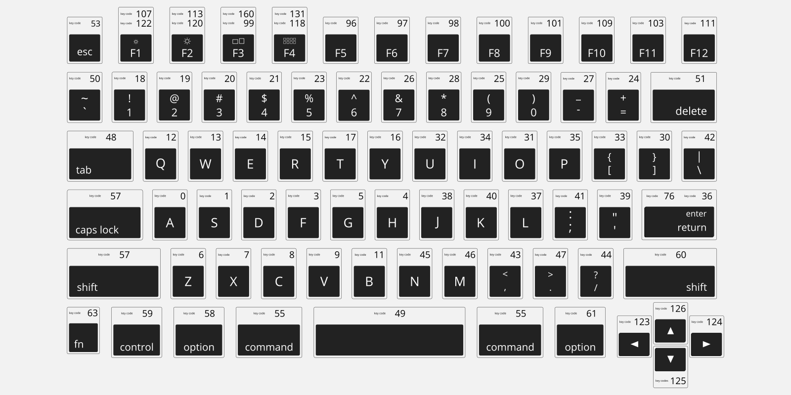

# FRACT-OL'

## Resources
### About fractals
- [What is a dimension](https://www.youtube.com/watch?v=7Yq8nqIn2X8)
- [What is a fractal dimension](https://www.youtube.com/watch?v=v273ElS1TRU)
- [Fractals & self-similarity](https://www.youtube.com/watch?v=gB9n2gHsHN4)

### MinilibX
- [Info](https://gontjarow.github.io/MiniLibX/)
- [Video tutorial](https://www.youtube.com/watch?v=bYS93r6U0zg)

### Apple script key codes
